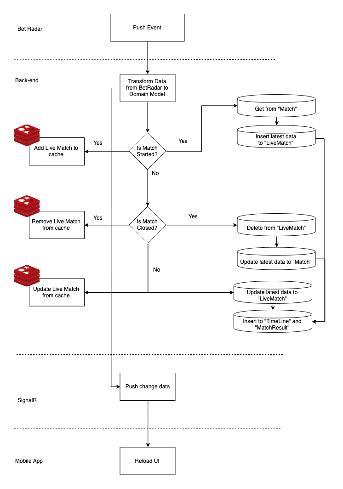

Push Change Flow
============

Introdution
-----------
- Event data received from Bet Radar include **MatchResult (Score and Status)** and **TimeLine**
- For more detail about push event, please refer `here <https://developer.sportradar.com/docs/read/football_soccer/Soccer_v3#tournament-seasons>`_.

Push Data Sample
----------------

.. code-block:: json

    {
        "sr:match:17458343": {
            "matchResult": {
                "matchStatus": {
                    "displayName": "Halftime",
                    "value": "1st_half"
                },
                "eventStatus": {
                    "displayName": "Live",
                    "value": "live"
                },
                "period": 0,
                "homeScore": 0,
                "awayScore": 0
            },
            "timeLines":
            [
                {
                    "id": 555147301,
                    "type": "injury_time_shown",
                    "time": "2019-05-08T19:47:17+00:00",
                    "matchTime": 45,
                    "matchClock": "45:00",
                    "stoppageTime": "1",
                    "period": 1,
                    "period_type": "regular_period",
                    "injuryTimeAnnounced": 2
                }
            ]
        }
    }

