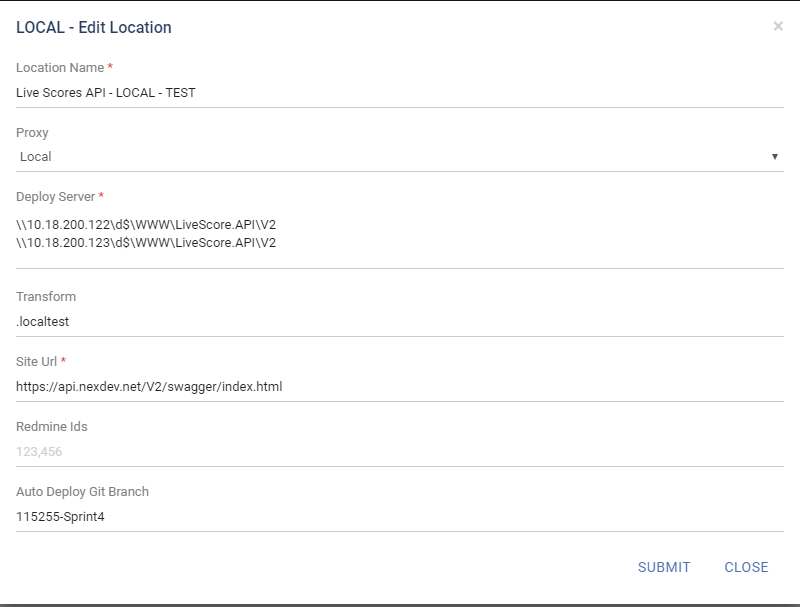

Feature branching
============

Sprint Development
-----------
- Each sprint has a branch with format *"{redmine_id}-Sprint{sprint_number}"*. Sprint branch will be configured for auto deployment.
- Each user story will be a branch *"{redmine_id}-Sprint{sprint_number}-{US}"*. It will be merged to sprint branch for deployment.

Auto deploy
-----------
- Go to Rocketor > Setting > Site > Location > Edit, update branch name for auto deployment.

Testflight release
-----------
- Create a tag with prefix "release-testflight"