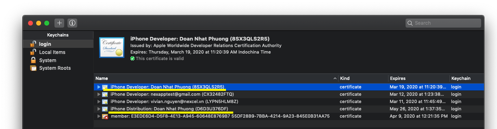
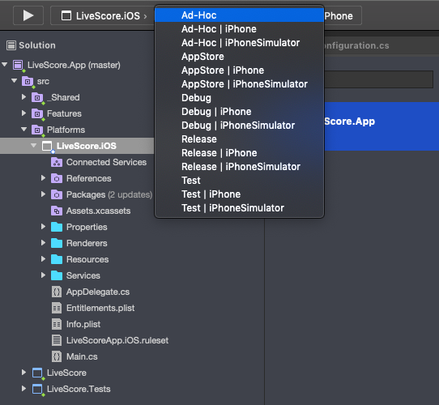
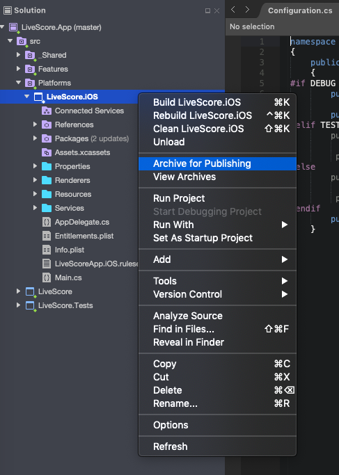

Testflight
============

Requirements
-----------
- Download certificates from git repository (https://gitlab.nexdev.net/livescore/LiveScoreApp/tree/master/files)
- Install iPhone Developer certificate
- Install iPhone Distribution certificate

- Application Loader In-app password

Deploy
-----------
- Select Configuration to deploy

> Release: https://api.nexdev.net/Main/api/

> Test: https://api.nexdev.net/V2/api/

> Dev: https://api.nexdev.net/V1/api/

- Right-Click on the iOS project, and select Archive for Publishing

- Creating an archive will automatically open the Archives View
- Select the Sign and Distribute

  .. image:: ../_static/testflight/sign_and_distribute.png
     :align: center

- Select the App Store distribution channel to create a package and Publish

  .. image:: ../_static/testflight/application_loader_1.png

  > Choose Next

  .. image:: ../_static/testflight/application_loader_2.png

  > Publish

  .. image:: ../_static/testflight/application_loader_3.png

  > Select folder to store .ipa file

  .. image:: ../_static/testflight/application_loader_4.png

- On the the Application Loader program, Select the Deliver Your App option, and upload the .ipa file created above

  .. image:: ../_static/testflight/upload_app_1.png
     :align: center

  .. image:: ../_static/testflight/upload_app_2.png
     :align: center

  .. image:: ../_static/testflight/upload_app_3.png
     :align: center

  .. image:: ../_static/testflight/upload_app_4.png
     :align: center

- Open TestFlight page (https://appstoreconnect.apple.com/), browse to the Prerelease tab of your app to verify the latest version.

  .. image:: ../_static/testflight/testflight_builds.png
     :align: center

Reference
-----------

https://docs.microsoft.com/en-us/xamarin/ios/deploy-test/testflight?tabs=macos#upload-your-app
