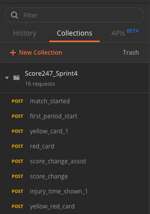
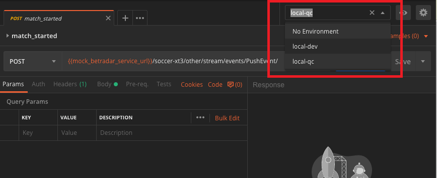

Postman
=======

Introduction
------------

Postman is used to share request for test data in teams

Using steps
-----------

- Download postman from  `here <https://www.getpostman.com/downloads>`_.
- Install then open and login with the account info below
- Look at the left panel and open the team collection and select the request

- Look at the right panel, change enviroment if necessary then execute request

Account Infomation
--------------------
- Username: score247
- Password: 1234aaAA

